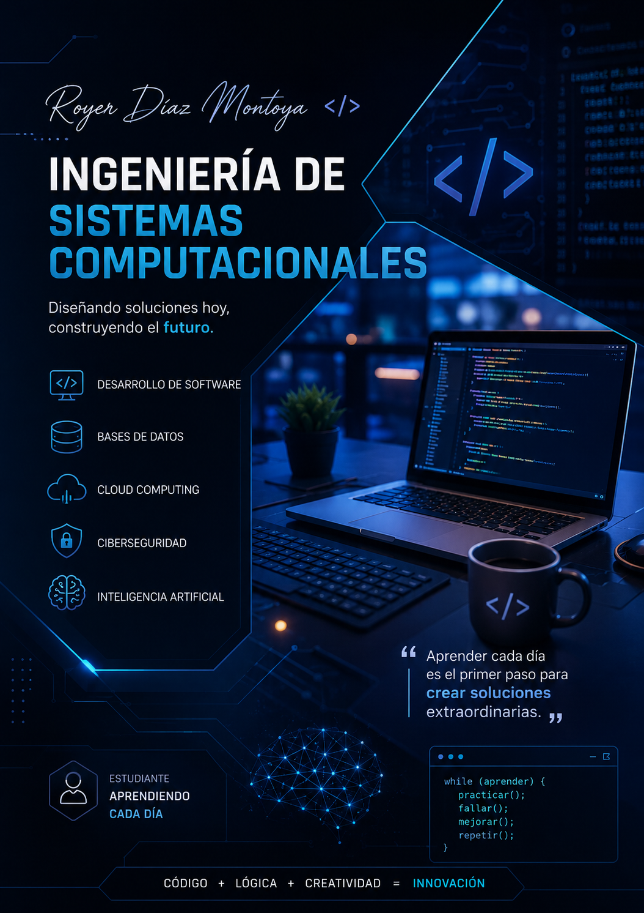

  

# 👋 Hola, soy Royer Díaz Montoya

🎓 Estudiante de Ingeniería de Sistemas Computacionales

💻 Actualmente aprendiendo:

- Python
- Java
- C#
- SQL Server
- Linux
- Redes
- Ciberseguridad
- Inteligencia Artificial

## 🚀 Mi objetivo

Convertirme en un ingeniero capaz de desarrollar soluciones tecnológicas que generen impacto en la sociedad.

## 🚀 Tecnologías y Herramientas

### 💻 Lenguajes de Programación

  
  

### 🌐 Desarrollo Web

  

### 🗄️ Bases de Datos

  
  

### ⚙️ Herramientas

  

### 🖥️ Sistemas Operativos

  

### 📚 Actualmente aprendiendo

  

